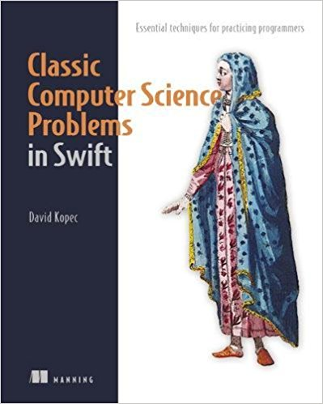

# Classic Computer Science Problems in Swift

## By David Kopec

This is the Xcode Playground to accompany the book *Classic Computer Science Problems in Swift* by David Kopec. The book is available for purchase [directly from the publisher, Manning](https://www.manning.com/books/classic-computer-science-problems-in-swift?a_aid=oaksnow&a_bid=8de75028), and from other book vendors.

## Versioning

The Playground is compatible with Swift 4 (Xcode 9).

## Links

### Get the Book

- [Manning](https://www.manning.com/books/classic-computer-science-problems-in-swift?a_aid=oaksnow&a_bid=8de75028)
- [Amazon](http://amzn.to/2xG6nlF)

### Classic Computer Science Problems Series

- [Classic Computer Science Problems informational site](https://classicproblems.com/)
- [Classic Computer Science Problems in Python](https://github.com/davecom/ClassicComputerScienceProblemsInPython)
- [Classic Computer Science Problems in Java](https://github.com/davecom/ClassicComputerScienceProblemsInJava)

### Open Source Projects Mentioned in the Book

- [SwiftPriorityQueue](https://github.com/davecom/SwiftPriorityQueue)
- [SwiftGraph](https://github.com/davecom/SwiftGraph)
- [SwiftCSP](https://github.com/davecom/SwiftCSP)
- [SwiftSimpleNeuralNetwork](https://github.com/davecom/SwiftSimpleNeuralNetwork)

### Free Content Based on the Book

- [Article: Solving Mazes with Swift](http://freecontent.manning.com/solving-mazes-with-swift/)
- [Article: Tic-Tac-Toe AI in Swift](http://freecontent.manning.com/classic-computer-science-problems-in-swift-tic-tac-toe/)
- [Slides: A* Search in Swift: Navigating a Maze](http://freecontent.manning.com/slideshare-a-search-in-swift-navigating-a-maze/)

### Miscellaneous

- [A Reimplementation of the Book in C++ (not by the author)](https://github.com/araya-andres/classic_computer_sci)

## License

The source code in this repository is licensed under the Apache License. See `LICENSE`.
